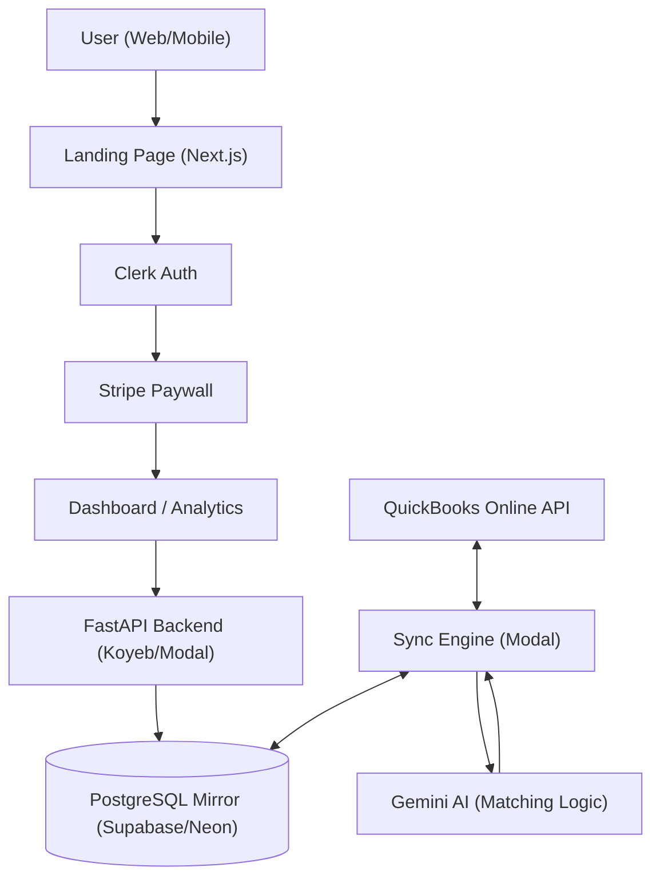

# Master Plan: Automatch Books AI

## Core Philosophy: "The Magical Mirror"
Accounting should feel like a byproduct of doing business. This project isn't just a data sync engine; it's an **Experience of Financial Clarity**. Every interaction must be kinetic, invisible, and accurate.

> [!IMPORTANT]
> **UX North Star**: Frictionless journeys and absolute user pleasure. The user dictates the flow; the AI provides the magic.

---

## 1. Architecture Overview
- **Core API**: FastAPI (Python) running in `backend/`.
- **Mirror Database**: PostgreSQL for multi-tenant data storage with RLS.
- **Serverless Infrastructure**: Modal for long-running sync and AI jobs.
- **AI Engine**: Google Gemini 1.5 Pro for transaction categorization and "Reasoning Narratives."
- **Authentication**: Clerk (Next.js) for secure, multi-tenant SaaS auth.

### SaaS Route Structure
- **Public (`/`)**: High-conversion Landing Page (Features, Pricing, Login).
- **Protected (`/dashboard`)**: The "Magical Mirror" App (Transactions, Sync).
- **Protected (`/analytics`)**: Financial Insights.

### System Blueprint

---

## 2. Implementation Roadmap

### Phase 0: SaaS Infrastructure (The Facade)
- [ ] **Route Migration**: Move current app logic to `/dashboard`.
- [ ] **Landing Page**: Build high-impact public home page with "Sign Up" flow.
- [ ] **Authentication**: Implement Clerk for user management and route protection.

### Phase 1: Foundation & Sync (The Mirror)
- [x] Establish QBO OAuth 2.0 flow.
- [x] Build multi-tenant PostgreSQL mirror.
- [x] Implement Modal serverless functions for background sync.
- [ ] Add error handling for QBO API rate limits.
- [ ] Implement secure webhook listener for real-time updates.

### Phase 1.5: Monetization (The Velvet Rope)
- [ ] **Stripe Integration**: Setup Stripe Checkout for SaaS subscription management.
- [ ] **Database Schema**: Add `subscription_tier`, `stripe_customer_id`, `subscription_status` to `users` table.
- [ ] **Paywall UI**: Implement the "Good/Better/Best" pricing cards with "7-Day Free Trial" logic.
- [ ] **Route Protection**: Middleware check for active subscription before allowing `/dashboard` access.

### Phase 2: AI & Interaction (The Magic)
- [x] Integrate Gemini with batching (20 TXs/request).
- [x] **[UX] Kinetic Feed**: Build the "Accept/Reject" feed with slide-out animations. (Implemented via Framer Motion & Bento Grid)
- [x] **[UX] "Hover to Trust"**: Hide reasoning narratives behind interactive triggers.
- [x] **[UX] Bulk Intelligence**: Implement "Select All" and "High-Confidence Auto-Accept."

### Phase 3: Insights & Visibility (The Clarity)
- [ ] Analytics: Implement Recharts for spend analysis with fluid, responsive typography.
- [ ] SEO: Achieve 100/100 Lighthouse score while maintaining premium glassmorphism.

---

## 3. UX Directives (Strict Execution)

### Architecture of Experience
- **Kinetic Feedback**: No action without motion. Accepted transactions MUST slide out; counters MUST pulse.
- **Optimistic Reliability**: UI updates instantly; the backend catches up in the background.
- **Hierarchical Confidence**: Use "Traffic Light" (Red/Amber/Green) indicators to guide attention.

### Component Directives
- **Transaction Cards**: "Reasoning Narratives" should be interactive accordions or hover-states to reduce clutter.
- **Typography**: Use `clamp()` for all headers to ensure perfect scaling on mobile devices.
- **Haptics**: (Capacitor) Trigger 'medium' haptic feedback on successful reconciliation.

---

## 4. Intelligence & Architecture Specs

### Database (The Source of Truth)
- **Schema**: Strictly follow `architecture/postgres_mirror_v3.sql`.
- **Multi-tenancy**: All tables must include `realm_id` with RLS policies enabled.
- **JSONB Strategy**: Store full QBO responses in `raw_json` for auditability.

### AI Logic (SOP & Reasoning)
- **Rule 1: Exact Match (Deterministic)**: Before calling AI, checking if the `description` matches a known vendor with a previously approved category. If yes, auto-categorize.
- **Rule 2: AI Guess (Gemini 1.5 Pro)**: If no exact match, invoke Gemini to analyze and suggest a category.
- **Rule 3: Confidence Threshold**:
  - `> 0.8`: Mark as "High Confidence" (Green).
  - `< 0.5`: Mark as "Needs Review" (Yellow/Red).
- **Explainability**: Every AI suggestion must include a "reasoning narrative" explaining the "Why".
- **Batching**: Process up to 20 TXs per request.
