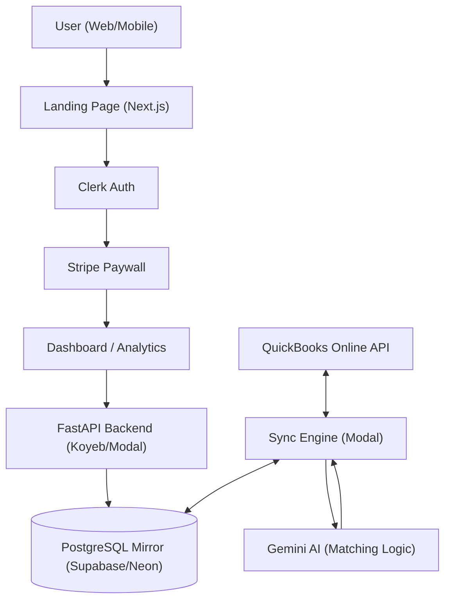

# Master Plan: AutoMatch Books AI

## Core Philosophy: "The Magical Mirror"
Accounting should feel like a byproduct of doing business. This project isn't just a data sync engine; it's an **Experience of Financial Clarity**. Every interaction must be kinetic, invisible, and accurate.

> [!IMPORTANT]
> **UX North Star**: Frictionless journeys and absolute user pleasure. The user dictates the flow; the AI provides the magic.

---

## 1. Architecture Overview

### Core Technology Stack (2026 Best Practices)

#### Backend Infrastructure
- **Core API**: FastAPI (Python 3.9+) with async/await patterns
  - **Why FastAPI**: Industry-standard for serverless Python APIs with native async support, automatic OpenAPI docs, and type-driven validation
  - **Alternative Considered**: Litestar (async-first, stricter architecture) - FastAPI chosen for ecosystem maturity
- **Mirror Database**: PostgreSQL with Row-Level Security (RLS)
  - **Connection Pooling**: **CRITICAL** - Use external PgBouncer in transaction pooling mode for serverless
    - Disable SQLAlchemy's internal pooling (`poolclass=NullPool`)
    - Prevents connection exhaustion from ephemeral serverless functions
    - Cloud options: AWS RDS Proxy, Supabase Supavisor, or Neon's built-in pooler
- **Serverless Infrastructure**: Modal for GPU-accelerated AI and background sync
  - **Why Modal**: Native Python support, auto-scaling, GPU access for AI workloads
  - **Alternatives Considered**: Runpod (GPU-focused), AWS Lambda + SageMaker (enterprise MLOps)
- **AI Engine**: Google Gemini 1.5 Pro/Flash with intelligent batching
  - **Batch API**: Use for non-urgent categorization (50% cost reduction, 24hr turnaround)
  - **Real-time API**: Reserve for interactive user corrections only
  - **Rate Limits**: Free tier = 15 RPM, 250K TPM; Tier 1 = 300 RPM
  - **Optimization**: Implement context caching for recurring vendor patterns (90% discount on cached tokens)
- **Authentication**: Clerk (Next.js 16) with server-side validation
  - **Security**: Always use `auth()` helper in Server Actions, never rely on middleware alone
  - **Session Management**: Short-lived JWTs (60s default) with automatic refresh

#### Frontend Stack
- **Framework**: Next.js 16 (App Router) with Turbopack bundler
  - **Performance**: 10x faster Fast Refresh, 2-5x faster production builds vs Webpack
  - **Routing**: Layout deduplication and incremental prefetching (massive bandwidth savings)
- **UI Library**: React 19 with automatic compiler optimization
  - **Compiler**: Auto-memoization reduces re-renders by 25-40% without manual `useMemo`/`useCallback`
- **Animation**: Framer Motion with bundle optimization
  - **Best Practice**: Use `LazyMotion` + `m` component instead of `motion` for smaller bundles
  - **GPU Acceleration**: Animate `transform` and `opacity` properties only
- **Payments**: Stripe with idempotent webhook handlers
  - **Critical**: Verify webhook signatures, store event IDs to prevent duplicate processing
  - **Pattern**: Return 200 OK immediately, offload processing to background queue

#### Third-Party API Integration

##### QuickBooks Online API
- **Library**: `intuit-oauth` (OAuth 2.0) + `requests` (REST calls)
  - **Why Direct REST**: More flexible than high-level wrappers for edge cases in transaction data
- **Best Practices**:
  - Use Change Data Capture (CDC) API instead of polling for updates
  - Implement webhooks for real-time entity change notifications
  - Include `request-id` query parameter for idempotency
  - Update minor version monthly (QBO releases monthly updates)
  - Use filters and max page size (1,000 records) to minimize API calls
- **Rate Limiting**: Implement exponential backoff for 429 errors
- **Security**: Encrypt access tokens before storage, use environmental variables for credentials

#### Deep Matching & Categorization Strategy ("The Elegant Fix")
Since QBO's "Bank Feed" (For Review) is API-inaccessible, we operate on the **Register Level**:
1.  **Categorization (Confirm Match)**: Use **Sparse Updates** on `Purchase`/`JournalEntry` entities.
    -   *Action*: Patch `AccountRef` from "Uncategorized" -> "Target Category".
    -   *Result*: Instant update in QBO Register; auto-resolves Bank Feed match.
2.  **Bill Matching**: Create `BillPayment` entities (Check/CreditCard) linking `Bill` to `BankAccount`.
    -   *Result*: QBO natively detects the payment and "Greens" the match in the UI.
3.  **Async Core**: Migrate `requests` to **`httpx`** for non-blocking I/O in FastAPI.
    -   *Benefit*: High-throughput batch processing without stalling the serverless container.

### SaaS Route Structure
- **Public (`/`)**: High-conversion Landing Page (Features, Pricing, Login).
- **Protected (`/dashboard`)**: The "Magical Mirror" App (Transactions, Sync).
- **Protected (`/analytics`)**: Financial Insights.

### System Blueprint

---

## 2. Implementation Roadmap

### Phase 0: SaaS Infrastructure (The Facade)
- [x] **Route Migration**: Move current app logic to `/dashboard`.
- [x] **Landing Page**: Build high-impact public home page with "Sign Up" flow.
- [x] **Authentication**: Implement Clerk for user management and route protection.

### Phase 1: Foundation & Sync (The Mirror)
- [x] Establish QBO OAuth 2.0 flow.
- [x] Build multi-tenant PostgreSQL mirror.
- [x] Implement Modal serverless functions for background sync.
- [x] Add error handling for QBO API rate limits.
- [x] Implement secure webhook listener for real-time updates.

### Phase 1.5: Monetization (The Velvet Rope)
- [x] **Stripe Integration**: Setup Stripe Checkout for SaaS subscription management.
- [x] **Database Schema**: Add `subscription_tier`, `stripe_customer_id`, `subscription_status` to `users` table.
- [x] **Paywall UI**: Implement the "Good/Better/Best" pricing cards with "7-Day Free Trial" logic.
- [x] **Subscription Gating**: Implement MiddleWare / Route protection to redirect unpaid users to `/pricing`.
- [x] **Stripe Webhooks**: Finalize webhook handler to sync subscription state with DB & Clerk.

### Phase 2: AI & Interaction (The Magic)
- [x] Integrate Gemini with batching (20 TXs/request).
- [x] **[UX] Kinetic Feed**: Build the "Accept/Reject" feed with slide-out animations. (Implemented via Framer Motion & Bento Grid)
- [x] **[UX] "Hover to Trust"**: Hide reasoning narratives behind interactive triggers.
- [x] **[UX] Bulk Intelligence**: Implement "Select All" and "High-Confidence Auto-Accept."

### Phase 3: Insights & Visibility (The Clarity)
- [x] Analytics: Implement Recharts for spend analysis with fluid, responsive typography.
- [x] **The Amplifier (SEO)**: Execute "Dominating the Algorithm" strategy (Schema, JSON-LD, Metadata, Semantics) to ensure 100/100 Lighthouse score.

### Phase 4: Architectural Cleanup (Maintenance)
- [x] **Legacy Deprecation**: Remove/Migrate `sync_engine.py` and `navigation.py` from root.
- [x] **Reliability**: Add error boundaries and fallback sync states for QBO API 401/429 errors.

### Phase 5: The Last Mile (Mobile & Advanced AI)
- [x] **Mobile Bridging**: Configure Capacitor for haptic-feedback support on iOS/Android.
- [x] **Transaction Splitting**: Implement AI logic to split bulk transactions into multiple categories.
- [x] **Receipt Mirroring**: Add support for matching scanned receipts to bank transactions.
- [x] **Serverless Offloading**: Migrated receipt processing to Modal for scalable AI workloads.

---

## 3. UX Directives (Strict Execution)

### Architecture of Experience
- **Kinetic Feedback**: No action without motion. Accepted transactions MUST slide out; counters MUST pulse.
- **Optimistic Reliability**: UI updates instantly; the backend catches up in the background.
- **Hierarchical Confidence**: Use "Traffic Light" (Red/Amber/Green) indicators to guide attention.

### Component Directives
- **Transaction Cards**: "Reasoning Narratives" should be interactive accordions or hover-states to reduce clutter.
- **Description Visibility**: Explicitly display `Memo` / `Note` field below the header if it differs from the Vendor Name.
- **Typography**: Use `clamp()` for all headers to ensure perfect scaling on mobile devices.
- **Haptics**: (Capacitor) Trigger 'medium' haptic feedback on successful reconciliation.

---

## 4. Intelligence & Architecture Specs

### Database (The Source of Truth)
- **Schema**: Strictly follow `architecture/postgres_mirror_v3.sql`.
- **Multi-tenancy**: All tables must include `realm_id` with RLS policies enabled.
- **JSONB Strategy**: Store full QBO responses in `raw_json` for auditability.

### AI Logic (SOP & Reasoning)
- **Rule 1: Exact Match (Deterministic)**: Before calling AI, checking if the `description` matches a known vendor with a previously approved category. If yes, auto-categorize.
- **Rule 2: AI Guess (Gemini 1.5 Pro)**: If no exact match, invoke Gemini to analyze and suggest a category.
- **Rule 3: Confidence Threshold**:
  - `> 0.8`: Mark as "High Confidence" (Green).
  - `< 0.5`: Mark as "Needs Review" (Yellow/Red).
- **Explainability**: Every AI suggestion must include a "reasoning narrative" explaining the "Why".
- **Batching**: Process up to 20 TXs per request.

---

## 5. Technical Debt & optimization Log
### Critical (Must Fix)
- [x] **Security**: `backend/app/main.py` has `allow_origins=["*"]`. This must be restricted to frontend domains.
- [x] **Dead Code**: `backend/app/services/ai_service.py` is unused and redundant.
- [x] **Hardcoded Prompts**: LLM prompts are buried in `sync_service.py`. Extract to `app/core/prompts.py`.
- [x] **Type Safety**: Frontend has distinct `any` types that violate strict mode.
- [x] **Performance**: `sync_service.py` does not use `requests.Session()` for connection pooling.
- [x] **Async Core**: Migrated `QBOClient` and `TransactionService` to `httpx` + `async/await` for serverless concurrency (Deep Matching Engine).
- [x] **Database Pooling**: Implemented `NullPool` in `app/db/session.py` for serverless compatibility (v3.18.0)

### Maintenance
- [ ] **Refactor**: `SyncService` is becoming a "God Class". Logic for Receipts, Sync, and AI should fundamentally be separated.
- [ ] **PgBouncer Deployment**: External connection pooler configured in code, needs cloud deployment (see `architecture/pgbouncer_setup.md`)

## 6. QC Audit Findings (2026-02-03)
### Critical (Must Fix)
- [ ] **UI/UX**: Navigation Header is missing on `/pricing` and `/features` pages. Only visible on Landing Page.
- [ ] **Auth**: Dashboard (`/dashboard`) is inaccessible for testing without a bypass or test account (Clerk in keyless dev mode).
- [ ] **Config**: Live Environment is using Clerk Development Keys (console warning observed).
- [ ] **Polish**: Version string (`f3.10.2`) is visible next to the logo on the landing page (likely debug artifact).
- [ ] **E2E Testing**: No automated mechanism to bypass Clerk Auth for full user flow auditing.

### Observations
- **Public Pages**: Landing page, Pricing, and Features load correctly (except missing header).
- **Backend**: API docs at `http://localhost:8000/docs` are accessible and healthy.

