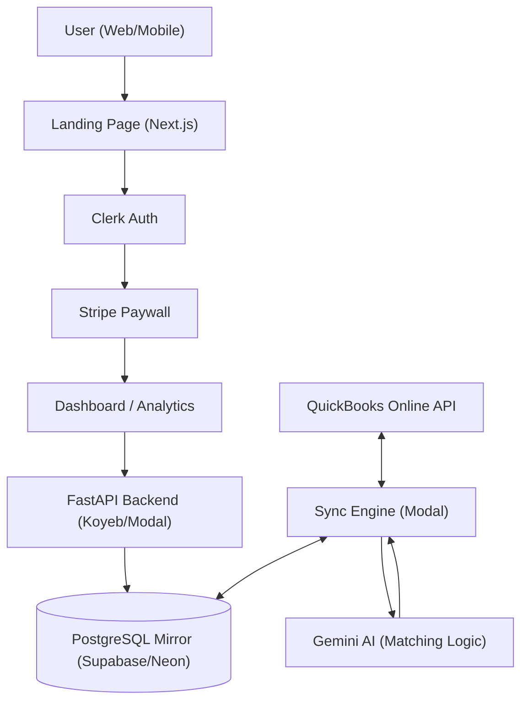

# Master Plan: AutoMatch Books AI

## Core Philosophy: "The Magical Mirror"
Accounting should feel like a byproduct of doing business. This project isn't just a data sync engine; it's an **Experience of Financial Clarity**. Every interaction must be kinetic, invisible, and accurate.

> [!IMPORTANT]
> **UX North Star**: Frictionless journeys and absolute user pleasure. The user dictates the flow; the AI provides the magic.

---

## 1. Architecture Overview

### Core Technology Stack (2026 Best Practices)

#### Backend Infrastructure
- **Core API**: FastAPI (Python 3.9+) with async/await patterns
  - **Why FastAPI**: Industry-standard for serverless Python APIs with native async support, automatic OpenAPI docs, and type-driven validation
  - **Alternative Considered**: Litestar (async-first, stricter architecture) - FastAPI chosen for ecosystem maturity
- **Mirror Database**: PostgreSQL with Row-Level Security (RLS)
  - **Connection Pooling**: **CRITICAL** - Use external PgBouncer in transaction pooling mode for serverless
    - Disable SQLAlchemy's internal pooling (`poolclass=NullPool`)
    - Prevents connection exhaustion from ephemeral serverless functions
    - Cloud options: AWS RDS Proxy, Supabase Supavisor, or Neon's built-in pooler
- **Serverless Infrastructure**: Modal for GPU-accelerated AI and background sync
  - **Why Modal**: Native Python support, auto-scaling, GPU access for AI workloads
  - **Alternatives Considered**: Runpod (GPU-focused), AWS Lambda + SageMaker (enterprise MLOps)
- **AI Engine**: Google Gemini 1.5 Pro/Flash with intelligent batching
  - **Batch API**: Use for non-urgent categorization (50% cost reduction, 24hr turnaround)
  - **Real-time API**: Reserve for interactive user corrections only
  - **Rate Limits**: Free tier = 15 RPM, 250K TPM; Tier 1 = 300 RPM
  - **Optimization**: Implement context caching for recurring vendor patterns (90% discount on cached tokens)
- **Authentication**: Clerk (Next.js 16) with server-side validation
  - **Security**: Always use `auth()` helper in Server Actions, never rely on middleware alone
  - **Session Management**: Short-lived JWTs (60s default) with automatic refresh

#### Frontend Stack
- **Framework**: Next.js 16 (App Router) with Turbopack bundler
  - **Performance**: 10x faster Fast Refresh, 2-5x faster production builds vs Webpack
  - **Routing**: Layout deduplication and incremental prefetching (massive bandwidth savings)
- **UI Library**: React 19 with automatic compiler optimization
  - **Compiler**: Auto-memoization reduces re-renders by 25-40% without manual `useMemo`/`useCallback`
- **Animation**: Framer Motion with bundle optimization
  - **Best Practice**: Use `LazyMotion` + `m` component instead of `motion` for smaller bundles
  - **GPU Acceleration**: Animate `transform` and `opacity` properties only
- **Payments**: Stripe with idempotent webhook handlers
  - **Critical**: Verify webhook signatures, store event IDs to prevent duplicate processing
  - **Pattern**: Return 200 OK immediately, offload processing to background queue

#### Third-Party API Integration

##### QuickBooks Online API
- **Library**: `intuit-oauth` (OAuth 2.0) + `requests` (REST calls)
  - **Why Direct REST**: More flexible than high-level wrappers for edge cases in transaction data
- **Best Practices**:
  - Use Change Data Capture (CDC) API instead of polling for updates
  - Implement webhooks for real-time entity change notifications
  - Include `request-id` query parameter for idempotency
  - Update minor version monthly (QBO releases monthly updates)
  - Use filters and max page size (1,000 records) to minimize API calls
- **Rate Limiting**: Implement exponential backoff for 429 errors
- **Security**: Encrypt access tokens before storage, use environmental variables for credentials

#### Deep Matching & Categorization Strategy ("The Elegant Fix")
Since QBO's "Bank Feed" (For Review) is API-accessible only as read-only register entries, we operate on the **Register Level** to trigger movement:
1.  **Categorization (Confirm Match)**: Use **Sparse Updates** on `Purchase`/`JournalEntry` entities.
    -   *Action*: Patch `AccountRef` from "Uncategorized" -> "Target Category".
    -   *Action*: Set `ClrStatus` to **`Cleared`** (in `AccountBasedExpenseLineDetail`). This is the "hidden switch" that tells QBO to move the transaction from "For Review" to "Categorized" in the Banking tab.
    -   *Marker*: Append **`#Accepted`** to `PrivateNote` (Memo). This ensures our app maintains a persistent "source of truth" even if QBO matching logic fluctuates.
2.  **Bill Matching**: Create `BillPayment` entities (Check/CreditCard) linking `Bill` to `BankAccount`.
    -   *Mechanism*: Use `LinkedTxn` array inside the `BillPayment` line item.
    -   *Result*: QBO natively detects the payment and "Greens" the match in the UI, moving it to Categorized automatically.
3.  **Refined Feed Logic**:
    -   `is_qbo_matched` (Categorized) = `(#Accepted in Note) OR (ClrStatus == 'Cleared') OR (Has LinkedTxn)`.
    -   `is_for_review` = `(No #Accepted) AND (ClrStatus != 'Cleared') AND (No LinkedTxn)`.
4.  **Async Core**: Migrate `requests` to **`httpx`** for non-blocking I/O in FastAPI.
    -   *Benefit*: High-throughput batch processing without stalling the serverless container.

### SaaS Route Structure
- **Public (`/`)**: High-conversion Landing Page (Features, Pricing, Login).
- **Protected (`/dashboard`)**: The "Magical Mirror" App (Transactions, Sync).
- **Protected (`/analytics`)**: Financial Insights.

### System Blueprint

---

## 2. Implementation Roadmap

### Phase 0: SaaS Infrastructure (The Facade)
- [x] **Route Migration**: Move current app logic to `/dashboard`.
- [x] **Landing Page**: Build high-impact public home page with "Sign Up" flow.
- [x] **Authentication**: Implement Clerk for user management and route protection.

### Phase 1: Foundation & Sync (The Mirror)
- [x] Establish QBO OAuth 2.0 flow.
- [x] Build multi-tenant PostgreSQL mirror.
- [x] Implement Modal serverless functions for background sync.
- [x] Add error handling for QBO API rate limits.
- [x] Implement secure webhook listener for real-time updates.

### Phase 1.5: Monetization (The Velvet Rope)
- [x] **Stripe Integration**: Setup Stripe Checkout for SaaS subscription management.
- [x] **Database Schema**: Add `subscription_tier`, `stripe_customer_id`, `subscription_status` to `users` table.
- [x] **Paywall UI**: Implement the "Good/Better/Best" pricing cards with "7-Day Free Trial" logic.
- [x] **Subscription Gating**: Implement MiddleWare / Route protection to redirect unpaid users to `/pricing`.
- [x] **Stripe Webhooks**: Finalize webhook handler to sync subscription state with DB & Clerk.

### Phase 2: AI & Interaction (The Magic)
- [x] Integrate Gemini with batching (20 TXs/request).
- [x] **[UX] Kinetic Feed**: Build the "Accept/Reject" feed with slide-out animations. (Implemented via Framer Motion & Bento Grid)
- [x] **[UX] "Hover to Trust"**: Hide reasoning narratives behind interactive triggers.
- [x] **[UX] Bulk Intelligence**: Implement "Select All" and "High-Confidence Auto-Accept."

### Phase 3: Insights & Visibility (The Clarity)
- [x] Analytics: Implement Recharts for spend analysis with fluid, responsive typography.
- [x] **The Amplifier (SEO)**: Execute "Dominating the Algorithm" strategy (Schema, JSON-LD, Metadata, Semantics) to ensure 100/100 Lighthouse score.

### Phase 4: Architectural Cleanup (Maintenance)
- [x] **Legacy Deprecation**: Remove/Migrate `sync_engine.py` and `navigation.py` from root.
- [x] **Reliability**: Add error boundaries and fallback sync states for QBO API 401/429 errors.

### Phase 5: The Last Mile (Mobile & Advanced AI)
- [x] **Mobile Bridging**: Configure Capacitor for haptic-feedback support on iOS/Android.
- [x] **Transaction Splitting**: Implement AI logic to split bulk transactions into multiple categories.
- [x] **Receipt Mirroring**: Add support for matching scanned receipts to bank transactions.
- [x] **Serverless Offloading**: Migrated receipt processing to Modal for scalable AI workloads.
- [x] **Serverless Scale**: Migrated QBO Webhooks and Bulk Transaction matching to Modal background workers.
- [x] **SaaS Gating**: Enforced subscription limits on sync and analysis endpoints.

---

## 3. Architecture of Integration (Research & Strategy)

### Competitor Logic Deconstruction
We analyzed the integration patterns of market leaders to reverse-engineer the "Perfect Sync".

#### 1. Dext Prepare (formerly Receipt Bank)
-   **Core Mechanic**: "Publish to QBO" is an explicit user action, not a continuous sync.
-   **Data Flow**:
    1.  **Extraction**: OCR extracts Date, Supplier, Amount, Tax.
    2.  **Validation**: Checks for existing suppliers in QBO cache. If new, forces user to create or map.
    3.  **The "Publish" Payload**: Creates a `Bill` or `Expense` object. Crucially, it attaches the document image as an `Attachable` linked to the transaction ID immediately after creation.
-   **Takeaway**: We must create the transaction *first*, get the ID, then upload the attachment. Atomic operations are key.

#### 2. SaasAnt Transactions
-   **Core Mechanic**: Bulk Excel/CSV Import.
-   **Secret Weapon**: **Pre-Validation Layer**. Before hitting the QBO API, it runs a local validation against cached QBO entities (Accounts, Classes, Locations).
-   **Error Handling**: If a row fails (e.g., "Account not found"), it skips that row but continues the batch, generating a specific error report.
-   **Takeaway**: Our AI must "Validate" suggestions against the `Chart of Accounts` mirror before presenting them to the user. Never suggest an invalid account.

#### 3. Hubdoc (Xero/Intuit)
-   **Core Mechanic**: Automated Fetching.
-   **Differentiation**: Logins to bank portals to scrape statements.
-   **Relevance**: While we are *not* building a scraper, their **"Duplicate Detection"** is superior. They check `Amount` + `Date` (+/- 3 days) + `Supplier` to flag potential duplicates before insertion.
-   **Takeaway**: Implement "Fuzzy Date Matching" (±2 days) when scanning for existing transactions to prevent double-entry.

### Recommended Technical Stack (Serverless Python)

#### Authentication & Client
-   **Library**: `intuit-oauth` (Official Intuit Python Client)
    -   *Why*: Handles the complex OAuth2 token rotation, refreshing, and standard compliance automatically. It is the only "safe" choice for long-term maintenance.
-   **API Interaction**: `httpx` (Async HTTP Client)
    -   *Why*: The official `python-quickbooks` library is synchronous and ORM-heavy (slow). For our serverless environment (Modal), we need raw, lightweight, asynchronous HTTP requests to handle high-concurrency batching.
    -   *Pattern*: Use `intuit-oauth` to get the robust token, then inject that token into `httpx` headers for blazing fast, parallel API calls.

#### Infrastructure Capability
-   **Runtime**: **Modal** (Serverless Python)
    -   *Fit*: Perfect for "Burst" workloads (syncing 1,000 transactions in 30 seconds) without paying for idle server time.
    -   *Architecture*:
        1.  **Trigger**: Webhook from QBO or User Login.
        2.  **Spin Up**: Modal container starts (Cold start < 2s).
        3.  **Execute**: `httpx` fetches standardized batches.
        4.  **Spin Down**: Zero cost when inactive.

---

## 4. Competitive Landscape & Strategic Gaps

### The "Holes" in the Industry (Our Opportunity)
Based on deep analysis of user complaints (G2, Capterra, Reddit) for Dext, SaasAnt, and Hubdoc, here are the **unmet needs** we will fill:

1.  **"Why did it do that?" (Explainability)**
    -   *The Gap*: Competitors are "Black Boxes". When Dext mis-categorizes a receipt, users don't know why.
    -   *The Fix*: **"Reasoning Narratives"**. Every AI suggestion comes with a one-sentence logic explanation (e.g., *"Categorized as 'Meals' because the vendor is 'Starbucks' and amount is < $20"*).
2.  **Mobile Command Center (Not Just Capture)**
    -   *The Gap*: Competitors treat mobile as a "Scanner" only. You can't effectively review or recategorize bulk transactions on a phone.
    -   *The Fix*: **Tinder for Taxes**. A fast, swipe-based interface for rapid reviewing on the go.
3.  **"Undo" / Safe-Mode**
    -   *The Gap*: Fear of clicking "Publish". Once it's in QBO, it's messy to fix.
    -   *The Fix*: **"The 10-Second Undo"**. A toast notification that holds the API call for 10s, allowing an instant revert.
4.  **Pricing Sanity**
    -   *The Gap*: SaasAnt uses confusing "Credits". Dext has hidden tiers.
    -   *The Fix*: **Flat, Usage-Based Transparency**.

### Feature Hierarchy (The Roadmap)

| Priority | Feature | Why it Matters | Competitor Status |
| :--- | :--- | :--- | :--- |
| **CRITICAL** | **Perfect Duplicate Detection** | If we duplicate a transaction, trust is lost instantly. | **Hubdoc**: Good **SaasAnt**: Weak |
| **CRITICAL** | **"Pre-Validation"** | "Check before you Send". Verify Vendor/Account exists in QBO *before* trying to sync. | **SaasAnt**: Excellent **Dext**: Good |
| **MUST HAVE** | **Split Transactions** | Ability to split a $100 Walmart bill into $50 "Groceries" and $50 "Supplies". | **All**: Basic Support |
| **MUST HAVE** | **Receipt Image Attachment** | The image MUST be attached to the QBO transaction, not just a link. | **Dext**: Gold Standard |
| **SHOULD HAVE** | **Vendor "Aliasing"** | Map "Amzn Mktp" and "Amazon.com" to a single "Amazon" vendor automatically. | **Dext**: Good **Hubdoc**: Weak |
| **WOULD BE NICE** | **Project/Class Tracking** | Assigning expenses to specific QBO Projects or Classes. | **Most**: Enterprise Plans only |
| **UNIQUE** | **"Confidence Traffic Lights"** | Green/Yellow/Red visual indicators of AI certainty. | **None**: Users guess the quality. |
| **UNIQUE** | **"Natural Language Rules"** | "Always mark Uber as Travel unless it's on a weekend". | **None**: Regex based only. |

---

## 5. UX Directives (Strict Execution)

### Architecture of Experience
- **Kinetic Feedback**: No action without motion. Accepted transactions MUST slide out; counters MUST pulse.
- **Optimistic Reliability**: UI updates instantly; the backend catches up in the background.
- **Hierarchical Confidence**: Use "Traffic Light" (Red/Amber/Green) indicators to guide attention.

### Component Directives
- **Transaction Cards**: "Reasoning Narratives" should be interactive accordions or hover-states to reduce clutter.
- **Description Visibility**: Explicitly display `Memo` / `Note` field below the header if it differs from the Vendor Name.
- **Typography**: Use `clamp()` for all headers to ensure perfect scaling on mobile devices.
- **Haptics**: (Capacitor) Trigger 'medium' haptic feedback on successful reconciliation.

---

## 6. Intelligence & Architecture Specs

### Database (The Source of Truth)
- **Schema**: Strictly follow `architecture/postgres_mirror_v3.sql`.
- **Multi-tenancy**: All tables must include `realm_id` with RLS policies enabled.
- **JSONB Strategy**: Store full QBO responses in `raw_json` for auditability.

### AI Logic (SOP & Reasoning)
- **Rule 1: Exact Match (Deterministic)**: Before calling AI, checking if the `description` matches a known vendor with a previously approved category. If yes, auto-categorize.
- **Rule 2: AI Guess (Gemini 1.5 Pro)**: If no exact match, invoke Gemini to analyze and suggest a category.
- **Rule 3: Confidence Threshold**:
  - `> 0.8`: Mark as "High Confidence" (Green).
  - `< 0.5`: Mark as "Needs Review" (Yellow/Red).
- **Explainability**: Every AI suggestion must include a "reasoning narrative" explaining the "Why".
- **Batching**: Process up to 20 TXs per request.

---

## 7. Technical Debt & optimization Log
### Critical (Must Fix)
- [x] **Security**: `backend/app/main.py` has `allow_origins=["*"]`. This must be restricted to frontend domains.
- [x] **Dead Code**: `backend/app/services/ai_service.py` is unused and redundant.
- [x] **Hardcoded Prompts**: LLM prompts are buried in `sync_service.py`. Extract to `app/core/prompts.py`.
- [x] **Type Safety**: Frontend has distinct `any` types that violate strict mode.
- [x] **Performance**: `sync_service.py` does not use `requests.Session()` for connection pooling.
- [x] **Async Core**: Migrated `QBOClient` and `TransactionService` to `httpx` + `async/await` for serverless concurrency (Deep Matching Engine).
- [x] **Database Pooling**: Implemented `NullPool` in `app/db/session.py` for serverless compatibility (v3.18.0)

### Maintenance
- [x] **Refactor**: `SyncService` is becoming a "God Class". Logic for Receipts, Sync, and AI should fundamentally be separated.
- [ ] **PgBouncer Deployment**: External connection pooler configured in code, needs cloud deployment (see `architecture/pgbouncer_setup.md`) - *Deferred to Infrastructure Sprint*

## 8. QC Audit Findings (2026-02-03)
### Critical (Must Fix)
- [ ] **UI/UX**: Navigation Header is missing on `/pricing` and `/features` pages. Only visible on Landing Page.
- [ ] **Auth**: Dashboard (`/dashboard`) is inaccessible for testing without a bypass or test account (Clerk in keyless dev mode).
- [ ] **Config**: Live Environment is using Clerk Development Keys (console warning observed).
- [ ] **Polish**: Version string (`f3.10.2`) is visible next to the logo on the landing page (likely debug artifact).
- [ ] **E2E Testing**: No automated mechanism to bypass Clerk Auth for full user flow auditing.

### Observations
- **Public Pages**: Landing page, Pricing, and Features load correctly (except missing header).
- **Backend**: API docs at `http://localhost:8000/docs` are accessible and healthy.

